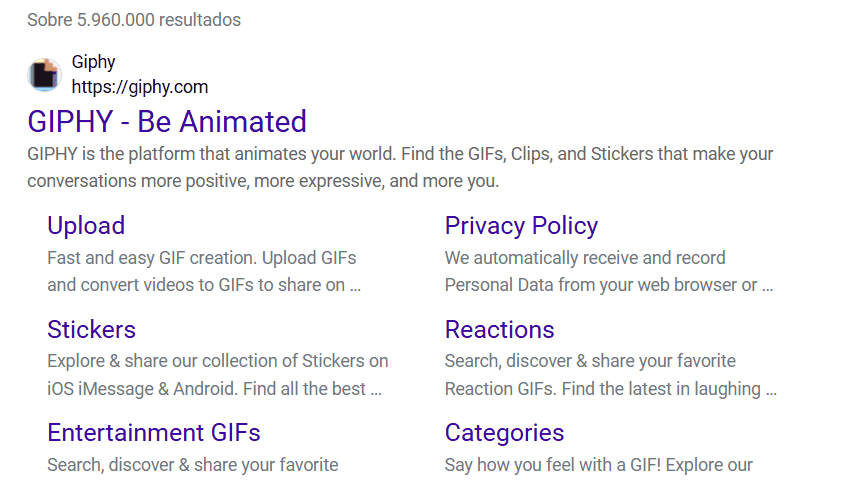

# Projeto com README
um projeto de arquivo com README
🎯

[]

## Tecnologias utilizadas
 - HTML
 - CSS
 - JS

 ## Como utilizar

 1 - Clone o projeto
 ```
 git clone <url>
 ```

 2 - Acesse a pasta do projeto
 ```
 cd repositorio-com-README
 ```
 4 - verificar status
 ```
 git status
 ```